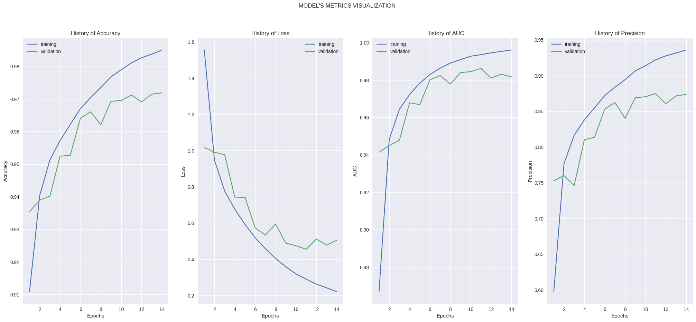
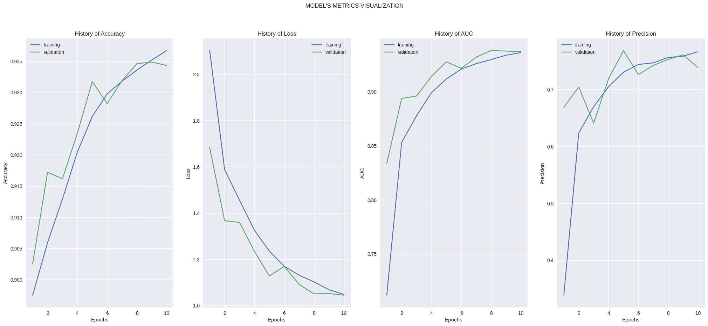

# Cifar 10 Neural Network

## Overview

Welcome to the GitHub repository for our advanced neural network architecture designed to tackle the CIFAR-10 dataset! This repository contains all the necessary code, documentation, and resources to help you understand, implement, and train the neural network model effectively.

## Table of Contents
- [Introduction](#introduction)
- [Training](#training)
- [Results](#results)
- [Reference](#reference)
- [license](#license)

## Introduction

The CIFAR-10 dataset is a well-known benchmark in the field of computer vision, consisting of 60,000 32x32 color images in 10 different classes, with 6,000 images per class. In this repository, we present a state-of-the-art neural network architecture designed to achieve high accuracy on this challenging dataset. Our architecture leverages the power of deep learning to achieve outstanding results, and we provide all the necessary tools for you to understand, implement, and extend this model.

## Training

[Google Colab](https://colab.research.google.com/drive/13RTWHPjCDT1bu5PZu7Zen5Jww5Mb7PVa?usp=sharing)

## Results

1. [Architecture 1](docs/arc_1.png)

[Complete graphics (Basic)](https://tensorboard.dev/experiment/82Hg4m0YQ1uMWkw69qSv6w/#scalars)

[Complete graphics (Best)](https://tensorboard.dev/experiment/jhqlZ8dBRtOzxMm9o8wQcw/#scalars)

2. [Architecture using transfer learning](docs/model_plot3.png)

[Complete Graphics (Transfer LEarning)](https://tensorboard.dev/experiment/o7f6pvAMT3KSpX88ge0h1Q/#scalars)

> Note: 

## Reference
1. [Datasets]() - [Learning Multiple Layers of Features from Tiny Images,](https://www.cs.toronto.edu/~kriz/learning-features-2009-TR.pdf) Alex Krizhevsky, 2009
2. [Layers Available](https://www.tensorflow.org/api_docs/python/tf/keras/layers)
3. [Fundamental Theory](https://books.google.com.co/books?id=RaRbNBqGR1oC&lpg=PA1&ots=2kkwXs9tJ4&dq=build%20a%20neural%20network&lr&hl=es&pg=PA1#v=onepage&q=build%20a%20neural%20network&f=false)
4. [Course Guide](https://platzi.com/cursos/redes-neuronales-tensorflow/)

## License

This repository is licensed under the [Apache 2.0](LICENSE) License. 