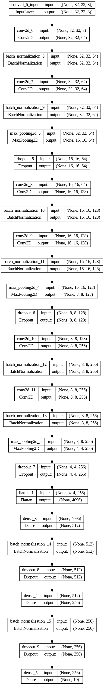
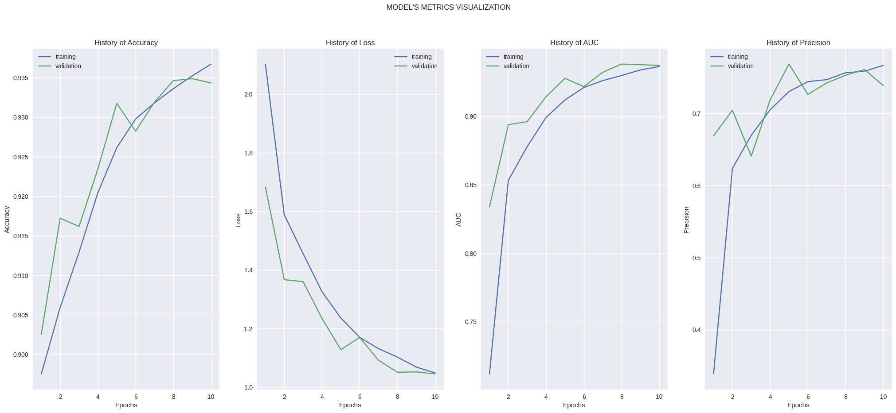

# Cifar 10 Neural Network
This repo contain  the code to train a simple object classier using #tensorlfow

The datasets has obtain usign the load datasets by tensorflow

The neural Network is build consider the size of the classes, the kind of object and the performarce optimization

Resumen First architecture tested 

[Complete graphics (Basic)](https://tensorboard.dev/experiment/82Hg4m0YQ1uMWkw69qSv6w/#scalars)

[Complete graphics (Best)](https://tensorboard.dev/experiment/jhqlZ8dBRtOzxMm9o8wQcw/#scalars)

[Complete Graphics (Transfer LEarning)](https://tensorboard.dev/experiment/o7f6pvAMT3KSpX88ge0h1Q/#scalars)

Note: 

## Reference
1. [Datasets]() - [Learning Multiple Layers of Features from Tiny Images,](https://www.cs.toronto.edu/~kriz/learning-features-2009-TR.pdf) Alex Krizhevsky, 2009
2. [Layers Available](https://www.tensorflow.org/api_docs/python/tf/keras/layers)
3. [Fundamental Theory](https://books.google.com.co/books?id=RaRbNBqGR1oC&lpg=PA1&ots=2kkwXs9tJ4&dq=build%20a%20neural%20network&lr&hl=es&pg=PA1#v=onepage&q=build%20a%20neural%20network&f=false)
4. [Course Guide](https://platzi.com/cursos/redes-neuronales-tensorflow/)