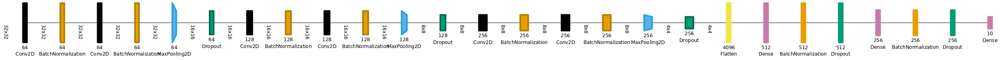

# Cifar 10 Neural Network

## Overview

This repository contains all the necessary code, documentation, and resources to help you understand, implement, and train the neural network model effectively.

## Table of Contents
- [Introduction](#introduction)
- [Training](#training)
- [Architecture](#architecture)
- [Results](#results)
- [Test yourself](#test-yourself)
- [License](#license)
- [Reference](#reference)


## Introduction

The CIFAR-10 dataset is a well-known benchmark in the field of computer vision, consisting of 60,000 32x32 color images in 10 different classes, with 6,000 images per class. In this repository, we present a state-of-the-art neural network architecture designed to achieve high accuracy on this challenging dataset. Our architecture leverages the power of deep learning to achieve outstanding results, and we provide all the necessary tools for you to understand, implement, and extend this model.

## Training

We use Google Colab to train this neural network, in this case we use the Nvidia Tesla T4 as GPU


[Google Colab](https://colab.research.google.com/drive/13RTWHPjCDT1bu5PZu7Zen5Jww5Mb7PVa?usp=sharing)

## Architecture 

<p align="center">
  
</p>

## Results


<p align="center">
  
</p>

> Note: The pre trainer model (use separate) tested are the follow
> - NASNetMobile
> - MobileNetV2
> - MobileNetV3Large
> - VGG19
> - VGG16 
> - DenseNet201
> - ResNet101
> The results show an improvement in precision and loss on **VGG19**, **VGG16** , **DenseNet201**, **MobileNetV2**

## Test yourself

```
    python test.py --model cifar10.h5 --image ./docs/test.jpg
```

```
docker run -d --name cifar_10 -p8000:80 danielsarmiento04/cifar10:4
```


## License

This repository is licensed under the [Apache 2.0](LICENSE) License. 

## Reference 

A. Bäuerle, C. van Onzenoodt and T. Ropinski, "Net2Vis – A Visual Grammar for Automatically Generating Publication-Tailored CNN Architecture Visualizations," in IEEE Transactions on Visualization and Computer Graphics, vol. 27, no. 6, pp. 2980-2991, 1 June 2021, doi: 10.1109/TVCG.2021.3057483.

Krizhevsky, A. (2009). Learning multiple layers of features from tiny images.

Skapura, D. M. (1996). Building neural networks. Addison-Wesley Professional.

TensorFlow Developers. (2023). TensorFlow (v2.15.0). Zenodo. https://doi.org/10.5281/zenodo.10126399

Platzi. (n.d.). Curso Profesional de Redes neuronales con tensorflow. http://platzi.com/cursos/redes-neuronales-tensorflow/. https://platzi.com/cursos/redes-neuronales-tensorflow/ 